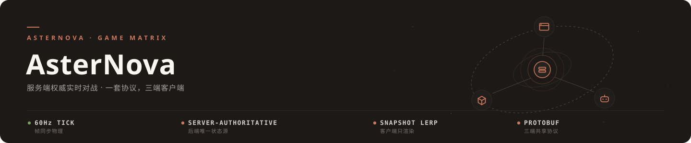
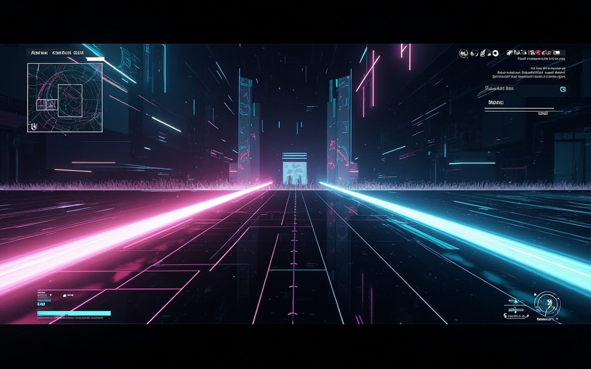
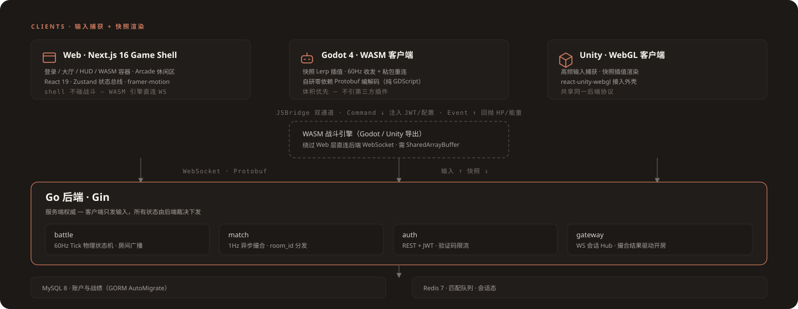
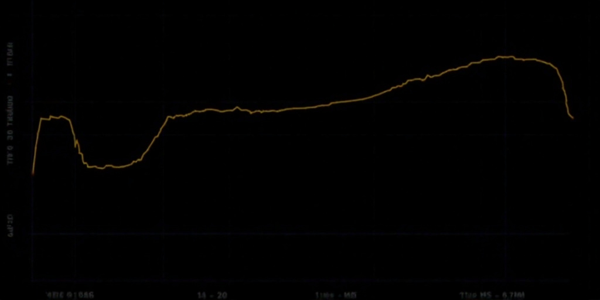
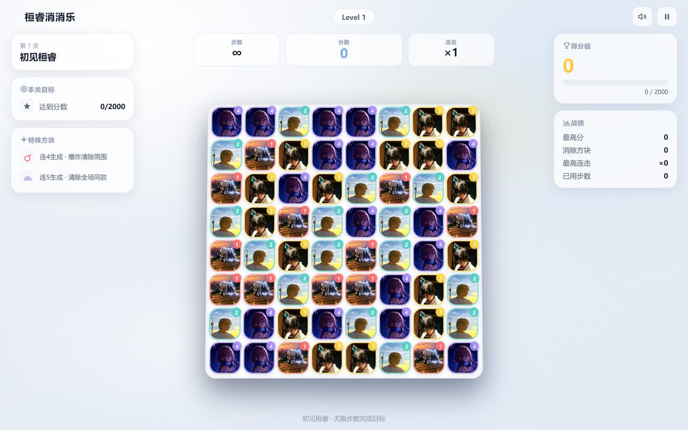
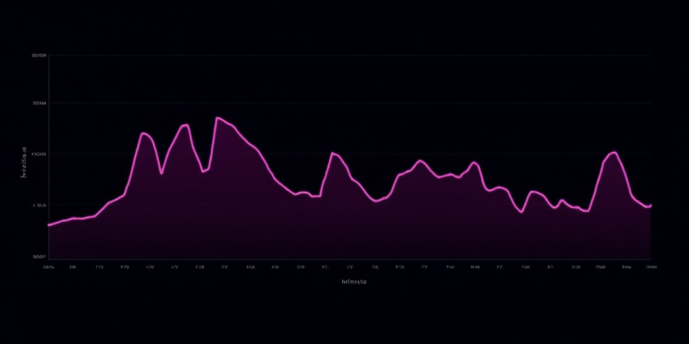

<div align="center">



# AsterNova

**服务端权威的实时联机动作游戏 · NPR 卡通渲染 · 一套后端，三端客户端**

*"Feel the impact, not the latency."*

[在线试玩（旧版）](https://asterforge.top/game) · [AsterForge](https://asterforge.top)

</div>

---

## 🚀 重启与路线图（2026-08 定案）

AsterNova 已按新栈重启：客户端收敛到 **Godot 4（Windows exe / Android APK / Web 三端）**，画面升级为 **NPR 卡通渲染**（toon ramp + SDF 面部阴影 + 描边 + 后处理，三档画质分级），UI 走**混合架构**（大厅 = Web / 战斗 HUD = Godot）。

- 📜 [总蓝图 BLUEPRINT.md](asternova/docs/BLUEPRINT.md) — 愿景、里程碑 M0-M4、验收节奏
- 🏗️ [技术架构 architecture.md](asternova/docs/architecture.md) — 技术栈定案、性能锚点、安全基线
- 🎨 [美术风格圣经 STYLE.md](asternova/docs/STYLE.md) — AI 资产管线的风格约束源

里程碑：**M0** 蓝图与仓库整理 → **M1** 渲染垂直切片（美术验证件）→ **M2** Transport 抽象 + client-godot-v2 → **M3** Windows exe 首验证 + WebView 嵌入 spike → **M4** Android + ENet + 真机画质验证。

## 战场（一代战绩，新栈保留后端核心）

<div align="center">

</div>

**赛博珍珠白竞技场**：Go 后端以 60Hz 裁决全部物理，客户端只做输入采集与快照插值——本地零预测、零作弊面。普攻命中 0.08s、拼刀 0.15s 的 **Hit-Stop 卡肉**，配合衰减式屏幕震动，把打击感做进引擎时间膨胀里。

## 架构

<div align="center">

</div>

三条铁律撑起整个系统：

1. **后端独占裁决权** — `battle` 服务跑 60Hz Tick 纯数学物理（矢量 / 碰撞盒 / 状态机），客户端上报输入、接收 `State Snapshot`（Protobuf 编码）、Lerp 插值渲染。
2. **UI 混合架构** — 大厅类界面（登录 / 主菜单 / 背包 / 设置）用 **Web（一份 React 应用）**：Windows 走系统 WebView2、Android 走系统 WebView、Web 端就是 DOM 本身；战斗 HUD（血条 / 技能 / 小地图 / 飘字）归 **Godot**。战斗时 WebView 挂起，引擎独占渲染。
3. **一套协议多端共享** — `game.proto` 以 backend 侧为源；传输层走可插拔 Transport 抽象（WS 先行，原生端 ENet UDP 后置）。

## 客户端矩阵

| | Godot 4（v2，主客户端） | Web Shell | 一代 Godot（冻结） |
|---|---|---|---|
| 状态 | **M2 启动开发** | 现役（将演化为官网 + 托管壳） | 冻结为参考实现 |
| 目标平台 | Windows exe · Android APK · Web WASM | 浏览器 | Web WASM |
| 技术栈 | GDScript · NPR 卡通渲染 · 三档画质 | Next.js 16 · React 19 · Zustand | GDScript · 自研零依赖 Protobuf |
| 目录 | `asternova/client-godot-v2`（规划） | [`asternova/web-client`](asternova/web-client) | [`asternova/client-godot`](asternova/client-godot) |

> Unity WebGL 客户端已归档（2026-08-30），历史可经 `git log` 追溯。

## 压测（单机腾讯云实测，完整图表见 [`asternova/assets/`](asternova/assets/)）

<div align="center">

</div>

| 指标 | 结果 |
|---|---|
| 60Hz Tick 稳定性 | 长尾稳定，无积压 |
| RTT | 局域网 <10ms · 公网 P95 <80ms |
| 满房间并发 CPU | 单核占用可控 |

## Arcade · 休闲矩阵

大厅 `/lobby` 内置纯前端小游戏，零后端依赖，随官网保留作引流位：

<table>
<tr>
<td width="50%" align="center">
<a href="https://game.asterforge.top/xiaoxiaole/">

</a>
<p><b>立体三消</b> — 12 关闯关</p>
<p><sub>4 连炸弹 · 5 连彩虹 · 连击 · 成就 · 双主题 · PWA 可安装</sub></p>
</td>
<td width="50%" align="center">

<p><b>shoot-them-all</b> — matter-js 物理弹幕</p>
<p><sub>另有 lets-running · merge · nebula-survivor</sub></p>
</td>
</tr>
</table>

## 快速开始

```bash
# 后端（:8081，Docker 起 PostgreSQL + Redis，启动时自动 migrate up）
cd asternova/backend && docker compose up -d && go run main.go

# Web 外壳
cd asternova/web-client && npm install && cp .env.development .env.local && npm run dev
```

> 服务端权威设计：客户端独立运行无法移动，必须先起后端；Godot 端需在 `GameManager.gd` 配 Mock Token。

## Monorepo

```
games/asternova/
├── docs/            # 蓝图三件套（BLUEPRINT / architecture / STYLE）← 开发决策锚点
├── web-client/      # Next.js 16 Game Shell + Arcade（现役，将演化为官网 + 托管壳）
├── backend/         # Go · Gin · WS · PostgreSQL(sqlc + golang-migrate) · Redis
├── client-godot/    # 一代 Godot 客户端（已冻结，见 FROZEN.md）
├── client-godot-v2/ # 新客户端（M2 启动）
└── assets/          # 共享静态资源
```

六仓经 `git subtree add`（保留完整历史）合并，原仓库归档只读，历史可在 `git log` 追溯。

---

<div align="center">
<sub>AsterForge · <a href="https://asterforge.top">asterforge.top</a> · 鄂ICP备2026015662号-1</sub>
</div>
