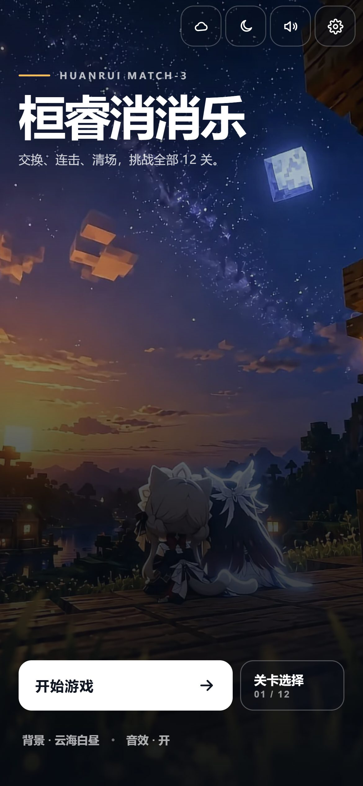
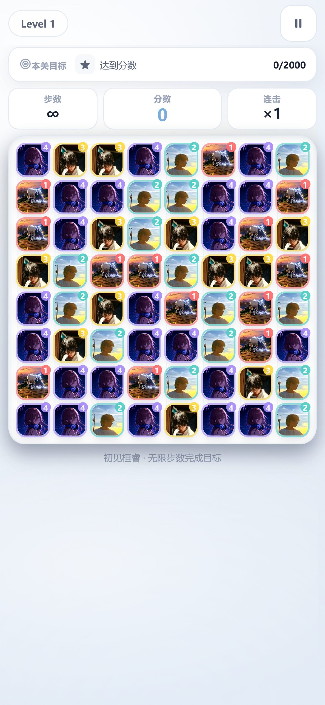
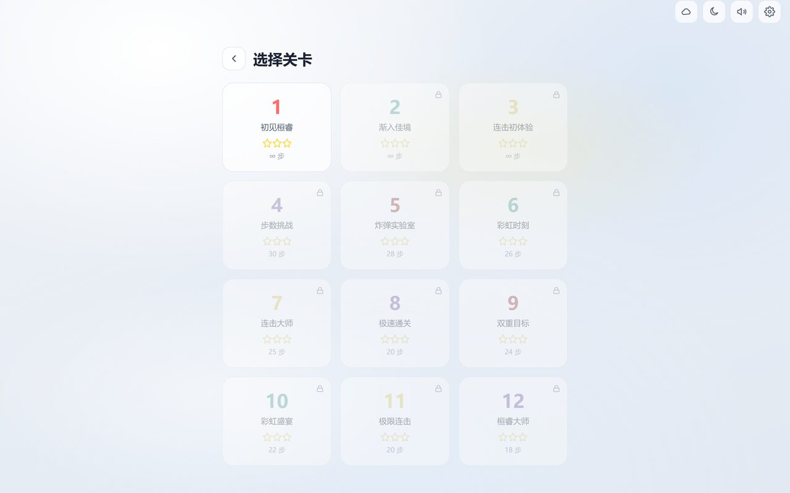

<div align="center">


# 桓睿消消乐 · HuanRui Match-3

**纯前端立体三消闯关游戏 · 零构建零依赖 · 手机电脑全适配**

[](https://game.asterforge.top/xiaoxiaole/)
[](LICENSE)
[](https://github.com/TimeCraker/huanrui-xiaoxiaole/pulls)


</div>

---

> 📖 本 README 分两部分：上半介绍本游戏，下半是**通用游戏开发蓝图**——
> 沉淀本项目踩过的坑，列出"一个正常游戏该有哪些基础项"，供以后做任何游戏时照着检查补全。

## 📑 目录

- [✨ 特性一览](#-特性一览)
- [📸 游戏演示](#-游戏演示)
- [🚀 快速开始](#-快速开始)
- [🎮 玩法](#-玩法)
- [🏗️ 技术架构](#️-技术架构)
- [📁 目录结构](#-目录结构)
- [📦 部署](#-部署)
- [🛠️ 本地开发](#️-本地开发)
- [🗺️ 通用游戏开发蓝图](#️-通用游戏开发蓝图)
- [💀 踩坑总结](#-踩坑总结)
- [📄 许可证](#-许可证)

---

## ✨ 特性一览

| 能力 | 说明 |
|---|---|
| 🎯 **立体棋盘** | CSS 3D 俯视（桌面），移动端自动切 2D 保性能 |
| 🎬 **流畅动效** | DOM 持久化 + transform 定位，交换/下落/消除全动画 |
| ✨ **消除特效** | Canvas 粒子 + 飘字 + 连击屏闪，按设备质量分 4 档 |
| 🎵 **真实音乐** | MP3 背景音乐列表，可切换，循环播放 |
| 🔊 **合成音效** | Web Audio 交换/消除/连击/炸弹/通关音，零音频文件 |
| 🧩 **12 关卡** | 前 3 关无限步数引导，后续递增难度 |
| 💣 **特殊方块** | 4 连炸弹、5 连彩虹、死局自动洗牌 |
| 🏆 **成就系统** | 12 个成就解锁通知 |
| 🎨 **双主题** | 浅色/深色 + 3 套背景一键切换 |
| ⚙️ **设置面板** | 音量/音乐/动效/触觉/特效质量全可控 |
| 📱 **响应式 PWA** | 手机/电脑/横竖屏，可安装可离线 |

## 📸 游戏演示

<div align="center">

**桌面端 · 主菜单**


**桌面端 · 游戏中**


**移动端**

<table>
<tr>
<td align="center"></td>
<td align="center"></td>
</tr>
<tr>
<td align="center">主菜单</td>
<td align="center">游戏中</td>
</tr>
</table>

**关卡选择**



</div>

## 🚀 快速开始

直接打开在线版即可游玩：

👉 **<https://game.asterforge.top/xiaoxiaole/>**

或本地运行：

```bash
git clone https://github.com/TimeCraker/huanrui-xiaoxiaole.git
cd huanrui-xiaoxiaole
python -m http.server 8000 --directory public
# 浏览器打开 http://localhost:8000
```

## 🎮 玩法

- **滑动**或**点选**相邻方块交换
- 三个及以上同色方块连成线即可消除
- **4 连**生成 💣 炸弹（3×3 爆炸）
- **5 连**生成 🌈 彩虹（清除全场同款）
- 连续消除触发**连击**，分数倍率递增
- 在步数内达成目标即可通关，获得 1-3 星

## 🏗️ 技术架构

```
┌─────────────────────────────────────────┐
│              index.html (入口)            │
├─────────────────────────────────────────┤
│  styles.css        │  game.js (IIFE)     │
│  · 双主题变量       │  · DOM 持久化棋盘    │
│  · 3D/2D 自适应     │  · 跟手拖动输入      │
│  · 响应式断点       │  · Canvas 粒子特效   │
│  · 质量分档 CSS     │  · Web Audio 音效    │
│                   │  · 成就/设置/状态机   │
├─────────────────────────────────────────┤
│  sw.js (Service Worker · 离线 + 自动更新)  │
├─────────────────────────────────────────┤
│  assets/ (照片方块 · 主视觉 · MP3 音乐)    │
└─────────────────────────────────────────┘
```

**核心设计：DOM 持久化 + transform 移动**
方块 DOM 只创建一次，位置变化只改 `transform: translate3d()`，CSS transition 自动产生动画。这是所有流畅动效的基础，避免了重建 DOM 的开销。

## 📁 目录结构

```
public/                     # 部署目录（静态托管）
├── index.html              # 入口
├── styles.css              # 样式（双主题/响应式/动效/质量分档）
├── game.js                 # 游戏核心（架构/逻辑/特效/音效/成就）
├── sw.js                   # Service Worker（离线缓存 + 自动更新）
├── manifest.webmanifest
└── assets/
    ├── faces/              # 方块照片（512×512）
    ├── backgrounds/        # 主视觉背景（WebP）
    └── music/              # 背景音乐 MP3（bgm1-4）
tools/                      # 构建与测试脚本
├── build_visual_assets.py  # 图片裁剪/主视觉生成
├── test.js                 # Playwright 功能测试
├── test_mobile_perf.js     # 移动端性能测试（CPU 限速）
└── test_*.js               # 各专项测试
docs/
├── images/                 # README 截图与 banner
├── stages/                 # 阶段开发记录
└── plans/                  # 交给其他模型执行的计划
```

## 📦 部署

静态文件部署到阿里云，Nginx 配置：

```nginx
location = /xiaoxiaole { return 301 /xiaoxiaole/; }
location /xiaoxiaole/ {
    alias /var/www/xiaoxiaole/;
    index index.html;
    try_files $uri $uri/ /xiaoxiaole/index.html;
}
```

```bash
# 部署命令（替换为你的服务器和密钥路径）
KEY=~/.ssh/your-server-key.pem
scp -F /dev/null -o StrictHostKeyChecking=no -i $KEY -r public/* root@YOUR-SERVER-IP:/var/www/xiaoxiaole/
```

> ⚠️ 部署后**务必升 SW 缓存版本号**（`sw.js` 的 `CACHE` + `game.js` 的 `CACHE_VER`），否则用户端不会及时更新。

## 🛠️ 本地开发

```bash
# 1. 生成图片素材（需 pillow）
python tools/build_visual_assets.py

# 2. 起静态服务器
python -m http.server 8000 --directory public

# 3. 功能测试（需 playwright + 系统 Chrome）
npm i -D playwright
node tools/test.js

# 4. 移动端性能测试（CPU 4× 限速模拟）
node tools/test_mobile_perf.js
```

## 🗺️ 通用游戏开发蓝图

> 做任何网页/小游戏时，用这张清单逐项检查是否补全。每项 = 一个"正常游戏该有"的基础能力。
> **不局限于三消**，这是从本项目提炼的可复用模板。

### 基础项清单

| 板块 | 是什么 | 为什么必须有 |
|---|---|---|
| 🏠 **主菜单** | 游戏入口封面 | 第一印象，决定"像不像游戏" |
| 🗺️ **关卡/进度** | 关卡选择 + 解锁存档 | 给玩家目标感和持续动力 |
| 🎮 **核心玩法** | 主操作循环 | 游戏的根，必须好玩且无 bug |
| 👆 **操作反馈** | 拖动跟手 + 音效 + 视觉 | 每次操作都要有即时回应 |
| ✨ **特效系统** | 粒子/飘字/震屏 | 让消除/得分有爽感 |
| 🎵 **背景音乐** | 循环 BGM + 可切换 | 氛围感的核心，没有就空 |
| 🔊 **音效** | 操作/消除/通关音 | 强化反馈，无声游戏很廉价 |
| 🏆 **成就系统** | 解锁 + 通知 | 长线目标，增加粘性 |
| ⚙️ **设置面板** | 音量/音乐/动效/触觉 | 玩家可控，无障碍必须 |
| 🎨 **主题/风格** | 浅色/深色 + 背景 | 视觉层次，适应环境 |
| ⏸️ **暂停/恢复** | 随时暂停 | 手机必备，防误操作 |
| 🎉 **胜负界面** | 胜利/失败 + 星级 | 闭环反馈，驱动重玩 |
| 📱 **响应式** | 手机/电脑/横竖屏 | 全平台可玩 |
| 📴 **离线 PWA** | Service Worker 缓存 | 断网可玩，可安装 |
| ⚡ **性能适配** | 按设备降级特效 | 低端机不卡，高端机好看 |

### 各板块实现要点

<details>
<summary><b>🏠 主菜单</b></summary>

- 用**真实主视觉**（照片/插画/视频）做背景，不要纯文字海报
- 标题克制：大字号粗体即可，**不要霓虹灯渐变流动**（俗气）
- 主 CTA（开始游戏）+ 次级入口（关卡选择）+ 工具入口（设置/音效）
- 入场动效：元素错峰淡入，不要同时弹出
</details>

<details>
<summary><b>🗺️ 关卡/进度</b></summary>

- localStorage 存：已解锁关卡、每关星级、最高分
- 前 1-3 关降低难度（无限步数/低目标），引导上手
- 关卡选择页可滚动，锁定的关卡灰显
- **平衡性**：第 1 关不能一步通关（目标分数要够高）
</details>

<details>
<summary><b>🎮 核心玩法</b></summary>

- **DOM 持久化架构**：元素创建一次，位置变化只改 `transform`，CSS transition 产生动画（不要重建 DOM）
- 死局检测：无可行操作时自动洗牌，永不卡死
- 提示系统：idle 5 秒高亮一个可行操作
- 输入：滑动 + 点选双模式，移动端轻滑即触发（阈值 0.2 格 + 速度判断）
</details>

<details>
<summary><b>👆 操作反馈</b></summary>

- 拖动**即时跟手**（onMove 直接写 transform，不要 RAF 合帧，会延迟）
- 每次消除：音效 + 粒子 + 飘字 +（大连击）震屏
- 无效操作：摇头/回弹 + 提示音
- 移动端加 `navigator.vibrate` 触觉反馈
</details>

<details>
<summary><b>✨ 特效系统</b></summary>

- 用**一个 Canvas + 粒子对象池**，不要每粒子建 DOM
- 粒子按需启动：无粒子时停止 RAF，不要永久空转
- **质量分档**：auto/high/medium/low，按 deviceMemory/hardwareConcurrency 自动选
- `prefers-reduced-motion` 永远覆盖为最低档
- 连击分档强调（3/5/8 连不同颜色），不要每次都全屏闪
</details>

<details>
<summary><b>🎵 背景音乐</b></summary>

- 用 `<audio loop>` 播 MP3，默认循环第 1 首
- 设置面板可切换曲目（上一首/下一首 + 曲名）
- BGM 音量 = 总音量 × 0.55（比音效低，不刺耳）
- 暂停游戏时音乐暂停，恢复继续
- **音频 URL 加版本号** `bgm.mp3?v=2.16`，替换同名文件后强制刷新缓存
- 免费音乐源：Pixabay / OpenGameArt / FreePD / Free Music Archive（CC0 可商用）
</details>

<details>
<summary><b>🔊 音效</b></summary>

- Web Audio API 合成（零文件、离线可用）
- 分类：选择/交换/消除/连击/炸弹/彩虹/胜利/失败/按钮/成就
- 连击音随 combo 升高音调
- 音量与 BGM 独立可控
</details>

<details>
<summary><b>🏆 成就系统</b></summary>

- 定义成就表（首次操作/连击档/特殊方块/通关/累计）
- 触发时弹通知（图标 + 名称），3 秒自动消失
- localStorage 持久化已解锁
</details>

<details>
<summary><b>⚙️ 设置面板</b></summary>

- 音效开关、音乐开关、音量滑块
- 动效开关、触觉开关
- 特效质量选择（自动/高/中/低）
- **从暂停弹窗也能进设置**（关闭设置时按状态恢复：playing 继续 / paused 回暂停弹窗）
</details>

<details>
<summary><b>🎨 主题/风格</b></summary>

- CSS 变量驱动浅色/深色，一键切换 + 记忆
- 多套背景（纯色渐变/动态粒子/照片模糊）
- 移动端**移除 `backdrop-filter`** 毛玻璃（合成成本高），用纯色背景
</details>

<details>
<summary><b>⏸️ 暂停/恢复</b></summary>

- 暂停时：停音乐、停提示计时、停动画循环、显弹窗
- 恢复时：按设置恢复音乐和动画
- **状态机要清晰**：menu/levels/intro/playing/paused，每个转移显式
</details>

<details>
<summary><b>🎉 胜负界面</b></summary>

- 胜利：星级评定（按步数/分数）+ 下一关 + 重玩 + 回菜单
- 失败：分数展示 + 重玩 + 回菜单
- 模态框 `max-height:88vh + overflow-y:auto`，防小屏按钮点不到
</details>

<details>
<summary><b>📱 响应式</b></summary>

- 移动端单列布局，桌面端三列
- 触控目标 ≥ 44px
- 横屏手机单独适配（隐藏侧栏，棋盘居中）
- `env(safe-area-inset-*)` 尊重刘海/底部条
</details>

<details>
<summary><b>📴 离线 PWA</b></summary>

- Service Worker 缓存核心资源
- **HTML 用 network-first**（保证入口页最新），静态资源 stale-while-revalidate
- 新 SW 接管后 `controllerchange` 自动刷新页面（首次安装不刷新）
- 每次部署升缓存版本号 + 资源 URL 加版本查询参数
</details>

<details>
<summary><b>⚡ 性能适配（重要）</b></summary>

- **3D 棋盘在移动端关闭**：`preserve-3d` + 多层 `translateZ` 在手机是 GPU 杀手，桌面端才开
- Canvas DPR 封顶：移动 ≤1.5，桌面 ≤2（裸 devicePixelRatio 在 3× 手机是 9 倍像素）
- **永久 `will-change` 不要给所有元素**（64 个方块全开爆显存），只给活动状态
- 持续 `filter` 动画（hue-rotate/drop-shadow）在移动端停掉，改 transform/opacity
- `backdrop-filter:blur()` 移动端移除
- `pointermove` 跟手用即时写入（transform 是合成属性不触发 layout）
- 页面进后台 `visibilitychange` 停所有 RAF
- `ResizeObserver` 替代频繁 resize 监听
</details>

## 💀 踩坑总结

本项目踩过的坑，避免重复：

1. **自动人脸裁剪不可信** — OpenCV 把草地/天空/衣服误检为脸。最终手动指定裁剪区域
2. **headless 桌面测不出手机卡顿** — 180fps 假象。要用 CPU 4× 限速 + 3× DPR 模拟
3. **3D 棋盘是手机卡顿元凶** — 不是 JS，是 64 个方块的 GPU 合成层。移动端关 3D 立刻流畅
4. **霓虹灯标题很土** — 渐变流动 + 流光 = 马路电灯牌。改克制大字 + 真实主视觉
5. **缓存更新是 SW 大坑** — 同名文件替换后 SW 仍给旧缓存。URL 加版本号才彻底解决
6. **状态机锁死** — 暂停→设置→关闭，state 卡 paused 无弹窗。关闭设置要按状态恢复
7. **RAF 合帧害跟手** — 拖动用 RAF 合帧引入 1 帧延迟，跟手交互要即时写入
8. **滑动阈值太重** — 0.35 格要滑很远。降到 0.22 + 速度判断，轻扫即触发
9. **图片无法多模态验证** — GLM 看不了图，裁剪/视觉判断必须交给多模态模型或用户

## 📄 许可证

[MIT License](LICENSE) - 游戏代码自由使用。

背景音乐：CC0（来源 Pixabay / OpenGameArt）。

---

<div align="center">

**[🎮 在线游玩](https://game.asterforge.top/xiaoxiaole/)** · **[📦 源码仓库](https://github.com/TimeCraker/huanrui-xiaoxiaole)**

Made with ❤️ by [TimeCraker](https://github.com/TimeCraker)

</div>
