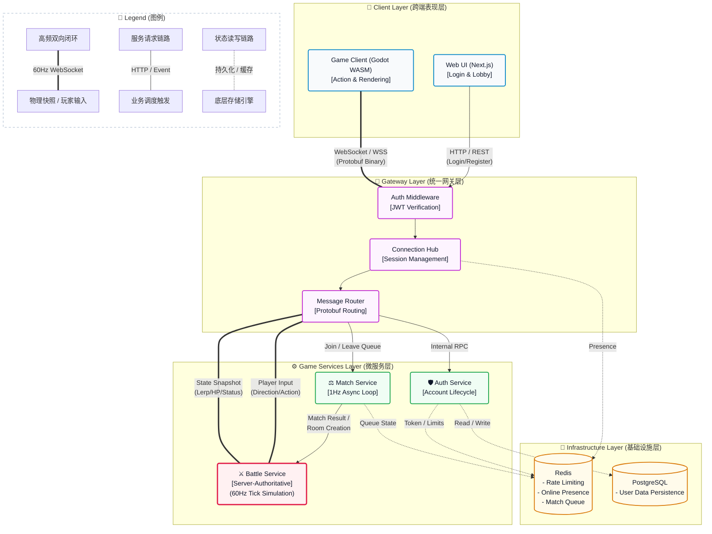

-----

# 🌌 AsterNova Game Server

   

**AsterNova** 是一个采用 Go 语言构建的工业级、模块化实时多人对战游戏服务端框架。本项目基于\*\*服务端权威（Server-Authoritative）\*\*网络架构设计，通过严格的高低频业务隔离与微服务化拆分，提供高频物理帧同步、严密的安全鉴权与极简的跨端（Web/移动端）扩展支持。

## 🗺️ 系统架构与数据流 (System Architecture & Data Flow)

架构图清晰定义了四大核心层级，重点突出了 `60Hz` 高频战斗状态机的数据流闭环与网关层的集线器职责：



## 🔄 核心链路拆解

1.  **鉴权与会话握手 (Auth & Session):**
      * 客户端经 Web 端完成 `HTTP/REST` 登录获取 JWT。
      * 游戏引擎携 JWT 向 Gateway 发起 WebSocket 连接，Gateway 在入口处通过 `Auth Middleware` 拦截校验。
      * 校验通过后，由 `Connection Hub` 接管 Session，并在 Redis 标记在线状态 (Online Presence)。
2.  **异步撮合与房间裂变 (Match to Battle):**
      * `Match Service` 采用独立 Goroutine 以 `1Hz` 频率轮询 Redis 队列。
      * 匹配成功后，直接向 `Battle Service` 派发房间创建指令，实现大厅与物理战局的无缝切换。
3.  **服务端权威物理闭环 (Server-Authoritative Loop):**
      * **上行：** Client 放弃本地绝对坐标控制，仅负责表现层渲染，并以 `60Hz` 通过 Gateway 上报操作输入（移动向量、攻击指令）。
      * **核心：** `Battle Service` 内置纯数学物理演算模型（矢量计算、碰撞盒、动作状态机），以固定的 `60Hz Tick Loop` 处理所有玩家输入，得出最终物理状态。
      * **下行：** `Battle Service` 将全场坐标、血量、硬直状态的 `State Snapshot` (Protobuf 编码) 经 Gateway 广播回客户端，客户端执行 Lerp 平滑插值。

## 📁 目录拓扑

```plaintext
AsterNova-Server/
├── proto/              # Protobuf 3 协议定义 (.proto) 与 pb.go 编译产物
├── services/           # 核心服务集群
│   ├── auth/           # 账户生命周期、验证码限流、JWT 签发
│   ├── gateway/        # 并发锁 (Mutex) Hub 状态管理、WebSocket 长连接收发
│   ├── match/          # 独立 1Hz 异步撮合引擎
│   └── battle/         # 60Hz 物理状态机、服务端权威运算逻辑
├── test/               # 压测工具与网关路由模拟
├── main.go             # 进程入口、DB 挂载与后台守护协程初始化
└── docker-compose.yml  # 本地容器化基建 (PostgreSQL, Redis)
```

## 🛠️ 快速启动

1.  **拉起基建:** 确保已安装 Docker，启动 PostgreSQL 16 与 Redis 实例。
    ```bash
    docker-compose up -d
    ```
2.  **配置环境:** 复制 `.env.example` 为 `.env`,填入 `JWT_SECRET`、`SMTP_SECRET` 等密钥（一律环境变量，永不入库）;数据库连接串 `DATABASE_DSN` 缺省连本地 `game_dev` 库。
3.  **启动网关与服务:** (进程启动时自动执行内嵌的 golang-migrate 迁移,幂等)
    ```bash
    .\scripts\local_up.ps1   # Windows 快捷部署
    # 或使用标准命令
    go run main.go
    ```
    服务将挂载于 `localhost:8081` 监听全栈网络请求。