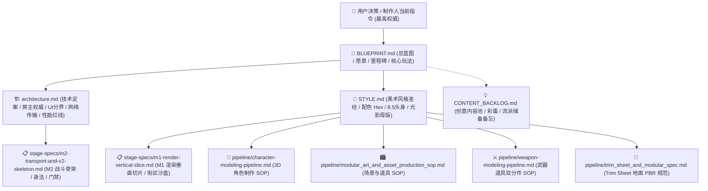

# AsterNova 核心技术与设计文档体系（Docs Hub）

> **最高决策权重顺序**：  
> **用户当前指令** > [BLUEPRINT.md](BLUEPRINT.md)（愿景与里程碑）> [architecture.md](architecture.md)（技术定案与红线）> [STYLE.md](STYLE.md)（美术风格圣经）> 阶段施工单 / 细分 SOP > 根目录 `CLAUDE.md`。

---

## 1. 技术决策与规范流向体系

---

## 2. 文档全景索引与职责矩阵

| 层级 | 文档路径 | 核心定位与职责 | 当前状态 | 关联实现代码 / 资产 |
| :--- | :--- | :--- | :---: | :--- |
| **顶层愿景** | [BLUEPRINT.md](BLUEPRINT.md) | 愿景、商业化节奏、单机优先+房主联机、核心玩法、M0~M4 里程碑 | **v1.0 定案** (2026-09 修订) | 全局指导 |
| **技术底座** | [architecture.md](architecture.md) | 核心技术选型、房主权威闭环、UI分界、网络选路、红线基线、MCP 双模协同 | **v1.0 定案** | `client-godot-v2/` `backend/` (二期) |
| **美学基准** | [STYLE.md](STYLE.md) | 配色 Hex 标定、Aster 角色形体、武器规范、冷峻天光母版、Forward+ 渲染四件套 | **M1 定型** (生成不设上限) | `render-lab/` `art/` |
| **内容储备** | [CONTENT_BACKLOG.md](CONTENT_BACKLOG.md) | 趣味互动彩蛋、后续角色设计、拓展流派、长线玩法构思池（不干扰主线极简） | **持续演进** | 备忘录 |
| **阶段施工** | [stage-specs/m1-render-vertical-slice.md](stage-specs/m1-render-vertical-slice.md) | M1 渲染垂直切片施工单：日漫清新街区场景 + Aster 渲染验收标准 | **推进中** | `render-lab/` |
| **阶段施工** | [stage-specs/m2-transport-and-v2-skeleton.md](stage-specs/m2-transport-and-v2-skeleton.md) | M2 战斗骨架施工单：高响应身法、四段流光刀术、软吸附、双视角、Transport 抽象 | **推进中** (69 项门禁全绿) | `client-godot-v2/` |
| **细分 SOP** | [pipeline/character-modeling-pipeline.md](pipeline/character-modeling-pipeline.md) | 3D 二次元角色工业化指南：8.5 头身鸣潮级体态、SDF 极净面部阴影、严禁无头手搓绑定 | **已生效** | `art/characters/` `scripts/pipeline/` |
| **细分 SOP** | [pipeline/modular_art_and_asset_production_sop.md](pipeline/modular_art_and_asset_production_sop.md) | 场景与道具资产指南：特定单体 Tripo + 几何手术，通用设施 Poly Haven MCP 直取 | **已生效** | `render-lab/models/` `scripts/pipeline/environment/` |
| **细分 SOP** | [pipeline/weapon-modeling-pipeline.md](pipeline/weapon-modeling-pipeline.md) | 3D 武器道具指南：星霜月华佩刀基准、零偏置双分件拔刀架构、轻量 899 三角面 | **已生效** | `art/characters/aster/` `scripts/pipeline/weapons/` |
| **细分 SOP** | [pipeline/trim_sheet_and_modular_spec.md](pipeline/trim_sheet_and_modular_spec.md) | 日系近未来 Trim Sheet 规范（仅适用于 Tier 1 地面 PBR；构件部分已废弃） | **收缩维护** | `render-lab/textures/` |
| **历史归档** | [archive/initial_prompt.md](archive/initial_prompt.md) | 早期角色建模任务的原始 Prompt 历史记录 | **已归档** | 历史备查 |

---

## 3. 核心铁律红线速查（Red Lines）

1. **渲染基线**：锁定 **Forward+ (Vulkan Clustered) + AgX 电影级色调映射（模式 4）**，PC 画面 120 FPS 起步上不封顶（与模拟 60Hz tick 解耦），绝不牺牲 PC 端游底座妥协画质。
2. **面数策略**：**生成阶段不设人工上限**（AI 生成一律取 Tripo 最高档），保证视觉细节打满；真机性能有压力后置自动化跑 LOD 减面兜底。
3. **角色绑定**：**严禁无头 Python 脚本手搓角色绑定与动画重定向**；有机角色必须使用工业标准 Humanoid 自动骨骼（AccuRIG / Mixamo / Tripo Auto-Rig）并交由 Godot 原生 BoneMap 引擎层对齐。
4. **建模审美闭环**：一切审美操作必须在 Blender MCP / 前台交互视口下完成，每修改一步必须截图自查；严禁用 Python 代码拼凑立体几何生物（严禁圆柱体猫/面团球灌木）。
5. **验收标准**：**唯一合法终验是 Godot 4.7 Forward+ 引擎 60FPS 实机窗口可交互画面**；DCC 视口截图不能代替实机验收。
6. **单体卡肉与软吸附**：**严禁在联机战斗中调用全局时间缩放（如 `Engine.time_scale = 0`）**，卡肉顿帧必须使用单体级冻结（Per-Entity Hitstop，仅冻结攻守双方 4~8 帧并配合视口震屏）；出刀软吸附采用 $\text{Score} = \text{Distance} \times 0.4 + \text{Angle} \times 0.6$ 锥形加权，杜绝近战砍空气与抢锁。
