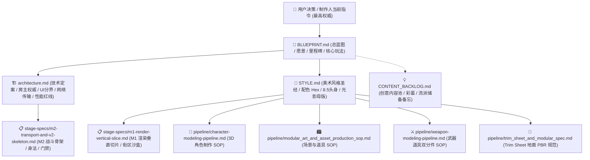

# AsterNova 核心技术与设计文档体系（Docs Hub）

> **2026-10-01 状态校正**：三角色动作工程原型可运行，但静态装配和艺术品质未通过。原“6/6”是历史工程交付记录，不能作为美术完成结论。当前先返工白色静态样板并等待用户确认；执行 `docs/stage-specs/character-art-rework.md`（相对 asternova 根目录）。

> **最高决策权重顺序**：  
> **用户当前指令** > [BLUEPRINT.md](BLUEPRINT.md)（愿景与里程碑）> [architecture.md](architecture.md)（技术定案与红线）> [STYLE.md](STYLE.md)（美术风格圣经）> 阶段施工单 / 细分 SOP > 根目录 `CLAUDE.md`。

---

## 1. 技术决策与规范流向体系

```mermaid
flowchart TD
    User["👤 用户决策 / 制作人当前指令 (最高权威)"] --> BP["📜 BLUEPRINT.md (总蓝图 / 愿景 / 里程碑 / 核心玩法)"]
    BP --> ARCH["🏗️ architecture.md (技术定案 / 房主权威 / UI分界 / 网络传输 / 性能红线)"]
    BP --> STYLE["🎨 STYLE.md (美术风格圣经 / 配色 Hex / 8.5头身 / 光影母版)"]
    
    ARCH --> StageM2["📋 stage-specs/m2-transport-and-v2-skeleton.md (M2 战斗骨架 / 身法 / 门禁)"]
    STYLE --> StageM1["📋 stage-specs/m1-render-vertical-slice.md (M1 渲染垂直切片 / 街区沙盒)"]
    
    STYLE --> PipeChar["🧬 pipeline/character-modeling-pipeline.md (3D 角色制作 SOP)"]
    STYLE --> PipeMod["🏙️ pipeline/modular_art_and_asset_production_sop.md (场景与道具 SOP)"]
    STYLE --> PipeWeap["⚔️ pipeline/weapon-modeling-pipeline.md (武器道具双分件 SOP)"]
    STYLE --> PipeTrim["🧱 pipeline/trim_sheet_and_modular_spec.md (Trim Sheet 地面 PBR 规范)"]
    
    BP -.-> Backlog["💡 CONTENT_BACKLOG.md (创意内容池 / 彩蛋 / 流派储备备忘)"]
```

---

## 2. 文档全景索引与职责矩阵

| 层级 | 文档路径 | 核心定位与职责 | 当前状态 | 关联实现代码 / 资产 |
| :--- | :--- | :--- | :---: | :--- |
| **顶层愿景** | [BLUEPRINT.md](BLUEPRINT.md) | 愿景、商业化节奏、单机优先+房主联机、核心玩法、M0~M4 里程碑 | **v1.0 定案** (2026-09 修订) | 全局指导 |
| **技术底座** | [architecture.md](architecture.md) | 核心技术选型、房主权威闭环、UI分界、网络选路、红线基线、MCP 双模协同 | **v1.0 定案** | `client-godot-v2/` `backend/` (二期) |
| **美学基准** | [STYLE.md](STYLE.md) | 配色 Hex 标定、Aster 角色形体、武器规范、冷峻天光母版、Forward+ 渲染四件套 | **M1 定型** (生成不设上限) | `render-lab/` `art/` |
| **内容储备** | [CONTENT_BACKLOG.md](CONTENT_BACKLOG.md) | 趣味互动彩蛋、后续角色设计、拓展流派、长线玩法构思池（不干扰主线极简） | **持续演进** | 备忘录 |
| **阶段施工** | [stage-specs/m1-render-vertical-slice.md](stage-specs/m1-render-vertical-slice.md) | M1 渲染垂直切片施工单：日漫清新街区场景 + Aster 渲染验收标准 | **推进中**（09-10 基线放行作废，待制作人终审） | `render-lab/` |
| **阶段施工** | [stage-specs/m2-transport-and-v2-skeleton.md](stage-specs/m2-transport-and-v2-skeleton.md) | M2 战斗骨架施工单：高响应身法、四段流光刀术、软吸附、双视角、Transport 抽象 | **推进中** (2026-09-10 快照 69 项门禁全绿，后持续扩容) | `client-godot-v2/` |
| **阶段施工** | [stage-specs/three-character-assembly-rigging.md](stage-specs/three-character-assembly-rigging.md) | 白/橙/紫三角色装配与动作验证施工单（工程 6/6 交付、美术未过转返工） | **被返工取代** | `art/characters/` `client-godot-v2/scenes/character_lab/` |
| **阶段施工** | [stage-specs/character-art-rework.md](stage-specs/character-art-rework.md) | 三角色静态美术返工施工单（白色静态样板确认门；配套交接 [character-art-rework-handoff.md](stage-specs/character-art-rework-handoff.md)） | **当前主线·推进中** | `art/characters/white/` |
| **阶段施工** | [stage-specs/purple-character-rework.md](stage-specs/purple-character-rework.md) | 紫色角色独立返工（单独授权并行；旧轮失败方案见 [purple-character-rework-handoff.md](stage-specs/purple-character-rework-handoff.md)） | **推进中**（5/8，待用户确认） | `art/characters/purple/rework/source_repair/` |
| **阶段草案** | [stage-specs/web-client-perf2-content.md](stage-specs/web-client-perf2-content.md) | web-client 性能二期 + 官网内容化（Perf 55+→70+） | **DRAFT 待评审** | `web-client/` |
| **游戏锚点** | [shoot-them-all-whitepaper.md](shoot-them-all-whitepaper.md) · [shoot-them-all-art-bible.md](shoot-them-all-art-bible.md) | 《弹珠风暴》玩法白皮书与美术圣经（完全重制定稿） | **已定稿** | `web-client/app/shoot-them-all/` |
| **游戏锚点** | [nebula-survivor-whitepaper.md](nebula-survivor-whitepaper.md) · [nebula-survivor-ui-spec.md](nebula-survivor-ui-spec.md) | 《星域突围》玩法白皮书（v2 施工化）与 UI 设计规格 | **已定稿** | `web-client/app/nebula-survivor/` |
| **UI 工艺** | [ui-polish/rules.md](ui-polish/rules.md) · [ui-polish/AUDIT.md](ui-polish/AUDIT.md) | web-client UI 打磨现行规则源与审计台账（R 序列现行，S5–S13 归档） | **现行** | `web-client/` `docs/ui-polish/` |
| **细分 SOP** | [pipeline/character-modeling-pipeline.md](pipeline/character-modeling-pipeline.md) | 3D 二次元角色工业化指南：8.5 头身鸣潮级体态、SDF 极净面部阴影、逐阶段装配、蒙皮与动作验证 | **已生效** | `art/characters/` `scripts/pipeline/` |
| **细分 SOP** | [pipeline/modular_art_and_asset_production_sop.md](pipeline/modular_art_and_asset_production_sop.md) | 场景与道具资产指南：特定单体 Tripo + 几何手术，通用设施 Poly Haven MCP 直取 | **已生效** | `render-lab/models/` `scripts/pipeline/environment/` |
| **细分 SOP** | [pipeline/weapon-modeling-pipeline.md](pipeline/weapon-modeling-pipeline.md) | 3D 武器道具指南：星霜月华佩刀基准、零偏置双分件拔刀架构、轻量 899 三角面 | **已生效** | `art/characters/aster/` `scripts/pipeline/weapons/` |
| **细分 SOP** | [pipeline/trim_sheet_and_modular_spec.md](pipeline/trim_sheet_and_modular_spec.md) | 日系近未来 Trim Sheet 规范（仅适用于 Tier 1 地面 PBR；构件部分已废弃） | **收缩维护** | `render-lab/textures/` |
| **细分 SOP** | [pipeline/character-art-generation-sop.md](pipeline/character-art-generation-sop.md) | 角色建模参考图生成与分层拆解 SOP（海报→素体→服装→头发→3D 模型五大目录规范） | **已生效** | 角色资产输入目录 |
| **细分 SOP** | [pipeline/character-specification-requirements.md](pipeline/character-specification-requirements.md) | 二次元高精角色需求与精细度技术规范（头身比 / A-Pose / 生成与装配验收依据；含 2026-10-01 返工规则） | **已生效** | `art/characters/` |
| **历史归档** | [archive/initial_prompt.md](archive/initial_prompt.md) | 早期角色建模任务的原始 Prompt 历史记录 | **已归档** | 历史备查 |

---

## 3. 核心铁律红线速查（Red Lines）

1. **渲染基线**：锁定 **Forward+ (Vulkan Clustered) + AgX 电影级色调映射（模式 4）**，PC 画面 120 FPS 起步上不封顶（与模拟 60Hz tick 解耦），绝不牺牲 PC 端游底座妥协画质。
2. **面数策略**：**生成阶段不设人工上限**（AI 生成一律取 Tripo 最高档），保证视觉细节打满；真机性能有压力后置自动化跑 LOD 减面兜底。
3. **角色绑定**：Blender 本地工具或适用的自动绑骨服务均可；逐阶段验证比例、rest pose、权重和动作。允许验证后的离线烘焙，骨名映射不能代替重定向检查。当前三角色见 [Stage Spec](stage-specs/three-character-assembly-rigging.md)。
4. **建模审美闭环**：UI、MCP 与脚本均须配合真实图像检查，使用工具本身不代表美术合格；避免未经检查的连续盲改。
5. **验收标准**：**唯一合法终验是 Godot 4.7 Forward+ 引擎 60FPS 实机窗口可交互画面**；DCC 视口截图不能代替实机验收。
6. **单体卡肉与软吸附**：**严禁在联机战斗中调用全局时间缩放（如 `Engine.time_scale = 0`）**，卡肉顿帧必须使用单体级冻结（Per-Entity Hitstop，仅冻结攻守双方 4~8 帧并配合视口震屏）；出刀软吸附采用 $\text{Score} = \text{Distance} \times 0.4 + \text{Angle} \times 0.6$ 锥形加权，杜绝近战砍空气与抢锁。
